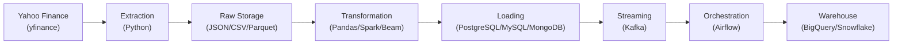

# 📈 Market Data Engineering Platform (MDEP)

> **An end-to-end ETL platform built to learn modern Data Engineering through practical implementation.**

<p align="center">


</p>

---

## 📖 Overview

**MDEP** is an educational, end-to-end **Extract, Transform, Load (ETL)** platform built by the **Everything Data** community over the **9-week WeThinkCode_ Data Engineering elective**. 
Every workshop extends the same codebase, introducing a new technology only when the project actually needs it, so the architecture grows the way a real data platform would.

The result is a portfolio-quality ETL pipeline that reflects the full curriculum, not a set of disconnected exercises.

**What this is:** a batch/stream ETL pipeline for market data extraction, transformation, validation, loading, orchestration, and warehousing.
**What this isn't:** a trading system, a price prediction model, or a dashboard. See [`docs/project/PROJECT_OVERVIEW.md`](docs/project/PROJECT_OVERVIEW.md) for the full scope.

---

## 🎯 Objectives

- Build a complete, end-to-end ETL pipeline.
- Learn Data Engineering by building one evolving system, not isolated demos.
- Apply every major technology covered in the curriculum, in the context that motivates it.
- Practice collaborative engineering with Git and GitHub.
- Produce a portfolio-quality project for every contributor.

Full rationale: [`docs/project/PROJECT_OVERVIEW.md`](docs/project/PROJECT_OVERVIEW.md)

---

## 📊 Project Status

| Milestone | Status |
| --- | --- |
| 1 Project Foundation | ⬜ Not started |
| 2 Extraction Layer | ⬜ Not started |
| 3 Transformation Layer | ⬜ Not started |
| 4 Loading Layer | ⬜ Not started |
| 5 Containerization | ⬜ Not started |
| 6 Distributed Processing | ⬜ Not started |
| 7 Stream Processing | ⬜ Not started |
| 8 Workflow Orchestration | ⬜ Not started |
| 9 Data Warehousing | ⬜ Not started |

Full roadmap and workshop schedule: [`docs/project/ROADMAP.md`](docs/project/ROADMAP.md)

---

## 🏗️ Architecture (at a glance)



Full architecture, ETL lifecycle, and validation/failure-handling design: [`docs/project/ARCHITECTURE.md`](docs/project/ARCHITECTURE.md) and [`docs/project/ETL_WORKFLOW.md`](docs/project/ETL_WORKFLOW.md)

---

## 🛠️ Technology Stack

| Layer | Technology |
| --- | --- |
| Extraction | Python, Yahoo Finance (`yfinance`) |
| Transformation | Pandas, Apache Spark, Apache Beam |
| Storage | PostgreSQL, MySQL, MongoDB |
| Streaming | Apache Kafka |
| Orchestration | Apache Airflow |
| Warehouse | BigQuery, Snowflake |
| Environment | Docker |

Why each tool was chosen, and when it enters the project: [`docs/project/ARCHITECTURE.md`](docs/project/ARCHITECTURE.md)

---

## 📁 Repository Structure

```text
market-data-engineering-platform/
├── docs/           # Project, community, and setup documentation
├── resources/      # Workshop notes, diagrams, datasets, references
├── src/            # ingestion, processing, storage, orchestration, streaming — organized by responsibility, not ETL phase
├── notebooks/
├── sql/
├── tests/
├── docker/
├── requirements.txt
├── docker-compose.yml
└── README.md
```

---

## 🚀 Getting Started

```bash
git clone https://github.com/yamkela-macwli/market-data-engineering-platform.git
cd market-data-engineering-platform
python -m venv .venv
source .venv/bin/activate   # .venv\Scripts\activate on Windows
pip install -r requirements.txt
```

Full environment setup (Docker, PostgreSQL, env vars): [`docs/setup/SETUP.md`](docs/setup/SETUP.md)

---

## 📖 Documentation

| Document | Description |
| --- | --- |
| [`docs/project/PROJECT_OVERVIEW.md`](docs/project/PROJECT_OVERVIEW.md) | Problem statement, objectives, in/out of scope, learning outcomes |
| [`docs/project/ARCHITECTURE.md`](docs/project/ARCHITECTURE.md) | Full system architecture and technology stack |
| [`docs/project/ETL_WORKFLOW.md`](docs/project/ETL_WORKFLOW.md) | Complete ETL lifecycle, functional & non-functional requirements |
| [`docs/project/ROADMAP.md`](docs/project/ROADMAP.md) | Milestones, curriculum progress, workshop schedule |
| [`docs/setup/SETUP.md`](docs/setup/SETUP.md) | Development environment setup |
| [`docs/community/CONTRIBUTING.md`](docs/community/CONTRIBUTING.md) | Contribution guidelines |

---

## 🤝 Contributing

We welcome contributions from all **Everything Data** members. Every change follows: fork → branch → implement → commit → push → pull request → review → merge.

See [`docs/community/CONTRIBUTING.md`](docs/community/CONTRIBUTING.md) for details.

---

## 👥 Community

**Everything Data**: a community dedicated to learning Data Engineering through collaboration, practical implementation, and continuous improvement.

## 📄 License

Licensed under the **MIT License**. See [`LICENSE`](LICENSE) for details.

---

> **"Learn Data Engineering by Building."**
