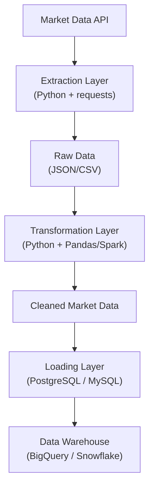
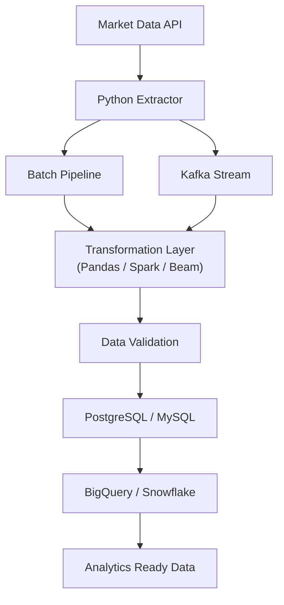
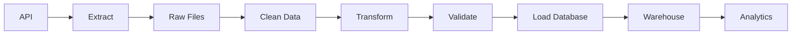

# Architecture

## System Overview

MDEP is an end-to-end ETL system that collects stock market data from a public API, transforms it into analytics ready datasets, and loads it into storage systems for analysis.

The architecture **extends** rather than replaces components as the elective progresses, nothing introduced in an earlier week gets torn out later.

---

## High Level Architecture (Early Weeks)



## High Level Architecture (Later Weeks)



---

## Architecture Layers

### Layer 1: Data Source

**Purpose:** Provide market data.

- **Tool:** Yahoo Finance (`yfinance`)
- **Output:** JSON, DataFrames

### Layer 2: Extraction

**Purpose:** Retrieve market data from the source.

- **Tools:** Python, `requests` (where applicable), `yfinance`
- **Responsibilities:** connect to API, download data, handle failures, save raw data

### Layer 3: Raw Storage

**Purpose:** Store data exactly as received no transformations occur here.

- **Formats:** CSV, JSON, Parquet (later)

### Layer 4: Transformation

**Purpose:** Convert raw data into usable information.

- **Tools:** Pandas (Weeks 1- 4), Apache Spark and Apache Beam (Week 5+)
- **Responsibilities:** remove duplicates, handle missing values, standardize dates, rename columns, calculate metrics, validate data

### Layer 5: Loading

**Purpose:** Persist transformed datasets.

- **Tools:** PostgreSQL, MySQL - later BigQuery, Snowflake

### Layer 6: Orchestration

**Purpose:** Automate the pipeline.

- **Tool:** Apache Airflow
- **Responsibilities:** schedule extraction, run transformations, trigger loading, monitor the pipeline

### Layer 7: Streaming

**Purpose:** Handle continuously arriving data.

- **Tool:** Apache Kafka
- **Responsibilities:** publish events, consume events, process streams

---

## ETL Workflow



Simple. Easy to understand. Easy to extend.

---

## Data Flow

Every workshop should fit somewhere in this diagram, so contributors can immediately see where a given lesson lands in the overall system:


---

## Technology Mapping

| Curriculum Topic | MDEP Component |
| --- | --- |
| Python | Pipeline implementation |
| Pandas | Data transformation |
| Linux | Development environment |
| Git | Version control |
| Docker | Containerized pipeline |
| PostgreSQL | Operational database |
| MySQL | Alternative relational database |
| MongoDB | NoSQL storage demonstration |
| REST APIs | Data extraction |
| Spark | Distributed processing |
| Beam | Batch and stream processing |
| Kafka | Streaming ingestion |
| Airflow | Workflow orchestration |
| BigQuery | Data warehouse |
| Snowflake | Cloud warehouse |
| AWS/GCP/Azure | Cloud platform concepts |

Every technology introduced in class has a defined role here, nothing is included just because it's on the syllabus.

---

## Repository Structure

`src/` is organized by **pipeline responsibility** rather than by generic ETL phase (`extract/`, `transform/`, `load/`). This scales better as the project grows and mirrors how production data engineering projects are typically laid out.
```text
market-data-engineering-platform/
│
├── docs/                                   # Project documentation
│   ├── project/                            # Project overview, architecture, ETL workflow and roadmap
│   ├── community/                          # Community guidelines, curriculum and workshop documentation
│   └── setup/                              # Installation, environment setup and development guides
│
├── resources/                              # Learning resources used throughout the community
│   ├── workshop-notes/                     # Notes, examples and summaries from each workshop
│   ├── diagrams/                           # Architecture, ETL and system diagrams
│   ├── datasets/                           # Sample datasets used during development and demonstrations
│   └── references/                         # External articles, documentation and useful resources
│
├── src/                                    # Main application source code
│   │
│   ├── ingestion/                          # Data extraction and ingestion layer
│   │   ├── api/                            # REST API clients and extraction logic
│   │   ├── batch/                          # Batch ingestion from files and scheduled jobs
│   │   └── streaming/                      # Streaming ingestion components
│   │
│   ├── processing/                         # Data transformation and processing layer
│   │   ├── pandas/                         # Data cleaning and transformation using Pandas
│   │   ├── spark/                          # Distributed processing using Apache Spark
│   │   └── beam/                           # Batch and stream processing using Apache Beam
│   │
│   ├── storage/                            # Data loading and persistence layer
│   │   ├── postgres/                       # PostgreSQL database implementation
│   │   ├── mysql/                          # MySQL database implementation
│   │   └── warehouse/                      # Data warehouse integrations (BigQuery & Snowflake)
│   │
│   ├── orchestration/                      # Workflow orchestration components
│   │   └── airflow/                        # Apache Airflow DAGs and scheduling
│   │
│   ├── streaming/                          # Event streaming infrastructure
│   │   └── kafka/                          # Kafka producers, consumers and stream configuration
│   │
│   ├── common/                             # Shared utilities, helper functions and reusable components
│   │
│   └── config/                             # Application configuration, environment settings and constants
│
├── notebooks/                              # Jupyter notebooks for experimentation and data exploration
│
├── sql/                                    # Database schemas, SQL scripts, migrations and queries
│
├── tests/                                  # Unit, integration and pipeline tests
│
├── docker/                                 # Dockerfiles, container configuration and Docker utilities
│
├── .github/                                # GitHub Actions, issue templates, pull request templates and workflows
│
├── requirements.txt                        # Python project dependencies
│
├── docker-compose.yml                      # Multi-container development environment configuration
│
├── README.md                               # Project overview and documentation entry point
│
└── LICENSE                                 # Open-source license for the project
```