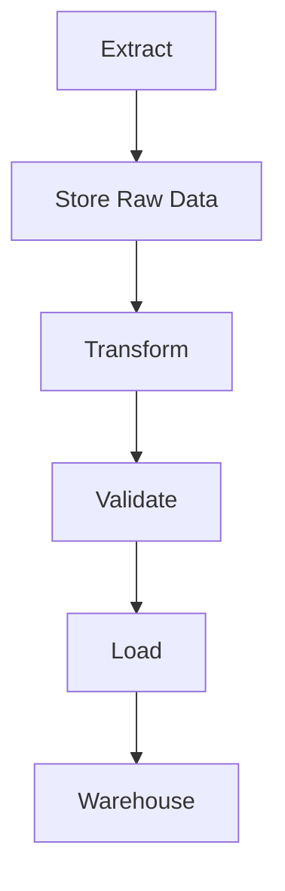

# ETL Workflow

## Lifecycle

Every workshop contributes to one or more of these stages. See [`ROADMAP.md`](ROADMAP.md) for the week-by-week breakdown.

---

## Functional Requirements

The platform shall:

- Extract market data on a schedule.
- Store raw data without modification.
- Transform raw data into cleaned datasets.
- Validate transformed data.
- Load processed data into storage.
- Support repeatable pipeline execution.
- Log pipeline execution status.
- Handle extraction failures gracefully.

---

## Non-Functional Requirements

The platform should be:

- Modular
- Maintainable
- Reproducible
- Well documented
- Easy to extend
- Consistent in coding standards
- Supportive of collaborative development

---

