# Roadmap

## Milestones

- [ ] Milestone 1 – Project Foundation
- [ ] Milestone 2 – Extraction Layer
- [ ] Milestone 3 – Transformation Layer
- [ ] Milestone 4 – Loading Layer
- [ ] Milestone 5 – Containerization
- [ ] Milestone 6 – Distributed Processing
- [ ] Milestone 7 – Stream Processing
- [ ] Milestone 8 – Workflow Orchestration
- [ ] Milestone 9 – Data Warehousing

---

## Curriculum Progress

- [ ] Python
- [ ] Linux & Bash
- [ ] Git & GitHub
- [ ] REST APIs
- [ ] Pandas
- [ ] Docker
- [ ] PostgreSQL
- [ ] MySQL
- [ ] Apache Spark
- [ ] Apache Beam
- [ ] Apache Kafka
- [ ] Apache Airflow
- [ ] BigQuery
- [ ] Snowflake

---

## Workshop Schedule

| Day | Time | Focus |
| --- | --- | --- |
| Tuesday | 13:00 – 14:00 | Engineering Concepts + Live Implementation |
| Wednesday | 13:00 – 14:00 | Practical Lab + Code Reviews |

---

## Engineering Journey

```mermaid
flowchart LR
    A["Python Project"] --> B["REST API Extraction"]
    B --> C["Raw Data Storage"]
    C --> D["Data Transformation"]
    D --> E["Relational Database"]
    E --> F["Docker"]
    F --> G["Apache Spark"]
    G --> H["Apache Kafka"]
    H --> I["Apache Airflow"]
    I --> J["Cloud Data Warehouse"]
    J --> K["Production-Style ETL Platform"]
```

Full architecture detail: [`ARCHITECTURE.md`](ARCHITECTURE.md)